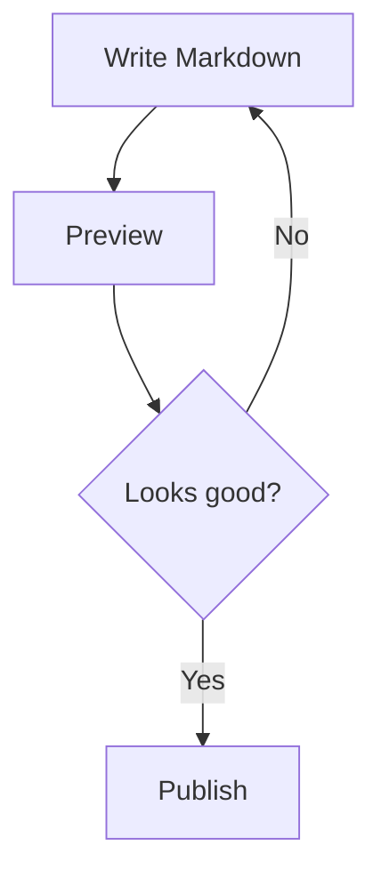

# mcp-markdown-to-confluence

An MCP (Model Context Protocol) server that converts Markdown files to Atlassian Document Format (ADF) and publishes them to Confluence. Mermaid diagrams are rendered to PNG images and uploaded as page attachments.

## Features

- Convert Markdown → Confluence ADF with full formatting support (tables, code blocks, callouts, TOC)
- Render Mermaid diagrams to PNG via headless Chromium and attach them to pages
- Preview content before publishing
- Create new pages or update existing ones
- Publish from inline Markdown or directly from a `.md` file using frontmatter

## Installation

### npm

```bash
npm install @neverprepared/mcp-markdown-to-confluence
```

### From source

```bash
git clone https://github.com/neverprepared/mcp-markdown-to-confluence.git
cd mcp-markdown-to-confluence
npm install
npm run build
```

## Configuration

Set the following environment variables:

| Variable | Description |
|---|---|
| `CONFLUENCE_BASE_URL` | Your Confluence base URL, e.g. `https://your-org.atlassian.net` |
| `CONFLUENCE_USERNAME` | Your Atlassian account email |
| `CONFLUENCE_API_TOKEN` | Your Atlassian API token ([create one here](https://id.atlassian.com/manage-profile/security/api-tokens)) |

## Claude Code Setup

Add to your Claude Code MCP config (`.claude/.claude.json`):

```json
{
  "mcpServers": {
    "markdown-to-confluence": {
      "command": "node",
      "args": ["/path/to/mcp-markdown-to-confluence/dist/index.js"],
      "env": {
        "CONFLUENCE_BASE_URL": "https://your-org.atlassian.net",
        "CONFLUENCE_USERNAME": "you@example.com",
        "CONFLUENCE_API_TOKEN": "your-api-token"
      }
    }
  }
}
```

## Tools

### `markdown_preview`

Convert Markdown to ADF and return a text preview — no Confluence calls made.

| Parameter | Type | Required | Description |
|---|---|---|---|
| `markdown` | string | yes | Markdown content to preview |
| `title` | string | yes | Page title |

### `markdown_publish`

Publish Markdown to a Confluence page. By default shows a preview first.

| Parameter | Type | Required | Description |
|---|---|---|---|
| `markdown` | string | yes | Markdown content |
| `title` | string | yes | Confluence page title |
| `spaceKey` | string | yes | Confluence space key (e.g. `ENG`) |
| `pageId` | string | no | Existing page ID to update; omit to create a new page |
| `parentId` | string | no | Parent page ID for new pages |
| `skip_preview` | boolean | no | Set `true` to publish without preview (default: `false`) |

### `markdown_publish_file`

Read a `.md` file from disk and publish it. Page metadata is read from frontmatter.

| Parameter | Type | Required | Description |
|---|---|---|---|
| `filePath` | string | yes | Absolute path to the Markdown file |
| `skip_preview` | boolean | no | Set `true` to publish without preview (default: `false`) |

**Supported frontmatter keys:**

```yaml
---
connie-title: My Page Title
connie-space-key: ENG
connie-page-id: "123456"   # omit to create a new page
title: Fallback title      # used if connie-title is absent
---
```

## Preview Flow

By default, `markdown_publish` and `markdown_publish_file` return a rendered preview and prompt you to confirm before publishing. To publish in one step, pass `skip_preview: true`.

```
# Step 1 — review
markdown_publish(markdown: "...", title: "My Page", spaceKey: "ENG")
→ returns preview text

# Step 2 — publish
markdown_publish(markdown: "...", title: "My Page", spaceKey: "ENG", skip_preview: true)
→ returns page URL
```

## Mermaid Diagrams

Mermaid code blocks are automatically detected, rendered to PNG via headless Chromium (bundled with Puppeteer), and uploaded as Confluence page attachments. The first run will download Chromium (~170 MB).

````markdown

````

## License

MIT
